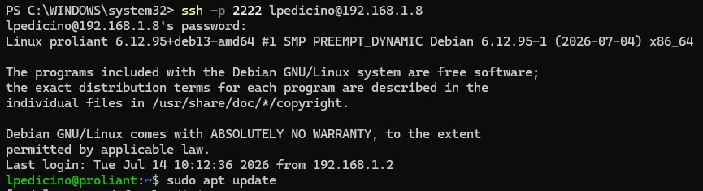
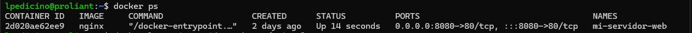
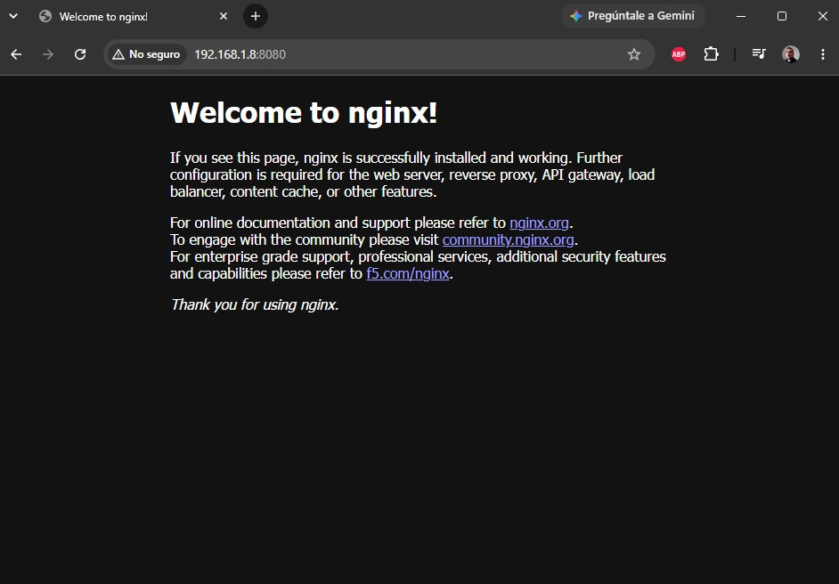

# Day 08 – ProLiant Server Setup: Docker, Nginx & Web Deployment

## Task
Deploy a web server, configure network access, and manage service logs. This exercise was performed on my on-premise ProLiant infrastructure, demonstrating how to implement production-grade server provisioning and network security policies in a physical environment.

## Commands Used
- `docker ps` / `docker ps -a`: To inspect container status and port mappings.
- `docker start <container_id>`: To initialize the Nginx service.
- `sudo ufw allow 8080/tcp`: To configure firewall rules on the ProLiant host, mimicking cloud Security Group logic.
- `docker logs <container_name> > ~/nginx-logs.txt`: To capture and persist service logs directly from the local container.
- `scp -P 2222 <user>@<ip>:~/nginx-logs.txt .`: To securely transfer logs from the ProLiant server to my local machine.

## Challenges Faced
- **Permissions:** Initial difficulty accessing the Docker daemon, resolved by adding the user to the `docker` group on the server.
- **Port Management:** Addressed a `Connection refused` error on `scp` due to the custom SSH configuration (port 2222) on the ProLiant host.
- **On-Premise Infrastructure:** Successfully adapted standard deployment workflows to a physical ProLiant server, ensuring that network security (`ufw`) matches the strict requirements typically found in cloud environments.

## What I Learned
- **Infrastructure Management:** Reaffirmed that DevOps fundamentals (SSH, firewalling, service deployment) are universal and apply equally to physical hardware and cloud instances.
- **Log Management:** Gained hands-on experience in capturing and extracting logs from containerized applications running on a remote physical server.
- **Security Hardening:** Applied host-level firewall rules (`ufw`) to secure the ProLiant node, allowing only necessary traffic for management (SSH) and services (HTTP).
- **Service Orchestration:** Validated the use of Docker for service isolation and port mapping (`8080:80`) on an internal network.

---

## Proof of Work

### 1. SSH Remote Access
Establishing a secure connection to the ProLiant server via port 2222.

### 2. Docker Container Status
Verifying that the Nginx container (`mi-servidor-web`) is running and correctly mapped to port 8080.

### 3. Service Verification
Accessing the Nginx landing page to confirm the web service is fully operational.
