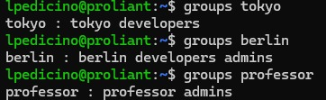
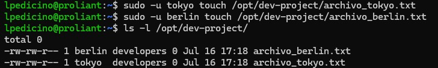
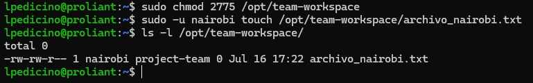

# Day 09 – Linux User & Group Management

## Users & Groups Created
- **Users**: tokyo, berlin, professor, nairobi
- **Groups**: developers, admins, project-team

## Group Assignments
- **tokyo**: developers, project-team
- **berlin**: developers, admins
- **professor**: admins
- **nairobi**: project-team

## Directories Created
- `/opt/dev-project` (Permissions: 2775, Group: developers)
- `/opt/team-workspace` (Permissions: 2775, Group: project-team)

## Commands Used
- `useradd -m <username>`: To create users with home directories.
- `passwd <username>`: To set user passwords.
- `groupadd <groupname>`: To create new groups.
- `usermod -aG <groups> <username>`: To add users to specific groups.
- `mkdir -p <path>`: To create directories.
- `chgrp <group> <path>`: To change group ownership.
- `chmod 2775 <path>`: To set permissions and activate SGID.
- `sudo -u <username> <command>`: To test permissions as a specific user.
- `ls -ld <path>` / `ls -l <path>`: To verify permissions and ownership.

## What I Learned
1. **Identity Management**: Gained practical experience in creating and managing Linux users and groups to control system access.
2. **Collaboration via SGID**: Learned that applying the `SGID` bit (`2775`) is critical in shared environments to ensure all new files automatically inherit the group owner, preventing permission bottlenecks.
3. **Privilege Delegation**: Reinforced the importance of applying the principle of least privilege by using specific groups and `sudo` for administrative tasks on the ProLiant infrastructure.

---

## Proof of Work

### 1. User and Group Setup

### 2. Directory Permissions & SGID Verification

### 3. Collaborative File Creation Test
