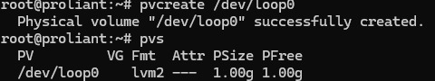
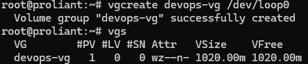
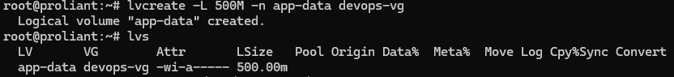
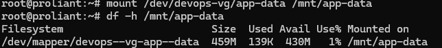
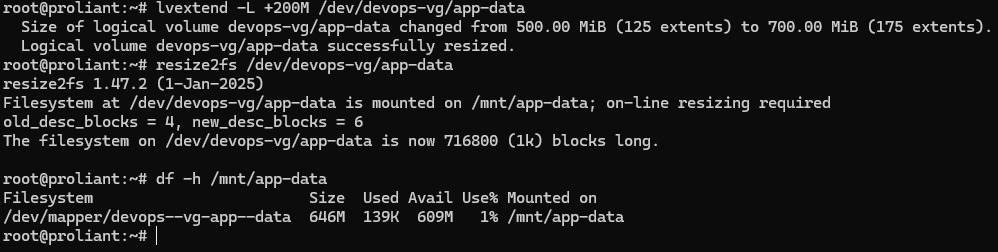

# Day 13 – Linux Volume Management (LVM)

## Commands Used

1. **Install LVM tools:**
   ```bash
   apt-get update && apt-get install -y lvm2
    ```

2.  **Create a virtual loop device for testing:**
```bash
dd if=/dev/zero of=/tmp/disk1.img bs=1M count=1024
losetup -fP /tmp/disk1.img
losetup -a
```

3. **Check current storage and initialize Physical Volume (PV):**
```bash
lsblk
pvcreate /dev/loop0
pvs
```

4. **Create Volume Group (VG):**
```bash
vgcreate devops-vg /dev/loop0
vgs
```

5. **Create Logical Volume (LV):**

```bash
lvcreate -L 500M -n app-data devops-vg
lvs
```

6. **Format and Mount the Logical Volume:**

```bash
mkfs.ext4 /dev/devops-vg/app-data
mkdir -p /mnt/app-data
mount /dev/devops-vg/app-data /mnt/app-data
df -h /mnt/app-data
```

7. **Extend the Volume and Resize Filesystem:**

```bash
lvextend -L +200M /dev/devops-vg/app-data
resize2fs /dev/devops-vg/app-data
df -h /mnt/app-data
```


## Screenshots of Outputs

### 1. Physical Volume (pvcreate / pvs)


### 2. Volume Group (vgcreate / vgs)


### 3. Logical Volume (lvcreate / lvs)


### 4. Mount & Disk Space (mount / df -h)


### 5. Extension & Resize (lvextend / resize2fs)


## What I Learned

1. **Flexibility of LVM:** LVM abstracts physical storage devices, allowing storage allocation to span across multiple disks or virtual devices effortlessly.
2. **Online Resizing:** Volumes can be dynamically extended on-the-fly (`lvextend` followed by `resize2fs`) without needing to unmount the filesystem or reboot the system.
3. **Storage Hierarchy:** LVM relies on three clear layers—Physical Volumes (PV), Volume Groups (VG), and Logical Volumes (LV)—giving administrators precise control over disk management.