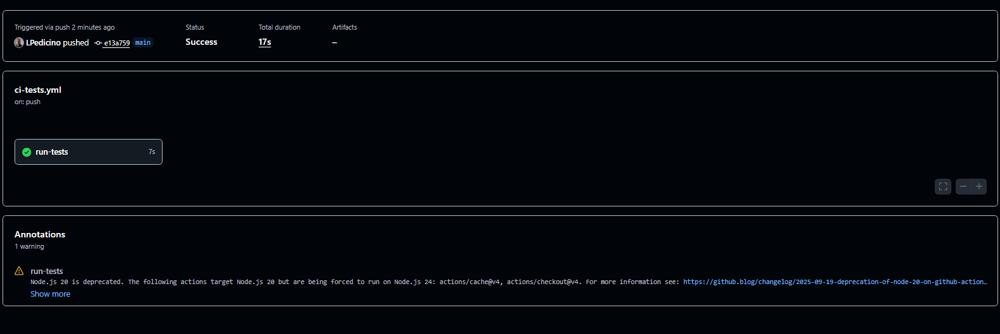

# Day 44: Secrets, Artifacts & Running Real Tests in CI

## 1. Why should you never print secrets in CI logs?
Even though GitHub automatically masks secrets (turning them into `***`), printing them or exposing them improperly can lead to security leaks if the masking fails, if logs are exported insecurely, or if unintended variations of the secret string get exposed.

## 2. When would you use artifacts in a real pipeline?
Artifacts are used to pass data or build outputs (like compiled binaries, test reports, logs, or frontend dist folders) between different jobs within the same workflow, or to store final build assets so developers can download and inspect them after a run.

## 3. Caching Notes (`actions/cache`)
- **What is cached?** Dependencies and directories (like `node_modules/`, Python virtual environments, or package manager caches).
- **Where is it stored?** In GitHub's cache storage infrastructure associated with the repository, speeding up subsequent runs by avoiding full downloads.

## Screenshot of CI Test Run

