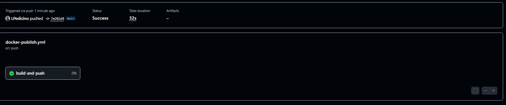

# Day 45: Docker Build & Push in GitHub Actions

## 1. Complete Workflow YAML
```yaml
name: Docker CI/CD

on:
  push:
    branches: [ "main" ]
  pull_request:
    branches: [ "main" ]

jobs:
  build-and-push:
    runs-on: ubuntu-latest
    steps:
      - name: Checkout repository
        uses: actions/checkout@v4

      - name: Log in to Docker Hub
        uses: docker/login-action@v3
        with:
          username: ${{ secrets.DOCKER_USERNAME }}
          password: ${{ secrets.DOCKER_TOKEN }}

      - name: Extract metadata for Docker
        id: meta
        uses: docker/metadata-action@v5
        with:
          images: lpedicino/devops-practice-app
          tags: |
            type=raw,value=latest,enable=${{ github.ref == 'refs/heads/main' }}
            type=sha,format=short

      - name: Build and push Docker image
        uses: docker/build-push-action@v5
        with:
          context: .
          push: ${{ github.ref == 'refs/heads/main' }}
          tags: ${{ steps.meta.outputs.tags }}
          labels: ${{ steps.meta.outputs.labels }}
```

## 2. Docker Hub Link
- [Docker Hub Repository](https://hub.docker.com/r/lpedicino/devops-practice-app)

## 3. Pipeline Run Screenshot


## 4. The Full Journey (Git Push to Running Container)
- **Code Commit & Push**: The developer pushes source code and configuration updates to the main branch.
- **CI Trigger**: GitHub Actions detects the push event and provisions an ephemeral ubuntu-latest runner environment.
- **Checkout & Auth**: The workflow checks out the repository codebase and securely authenticates with Docker Hub using encrypted repository secrets (DOCKER_USERNAME and DOCKER_TOKEN).
- **Metadata & Build**: docker/metadata-action automatically formats tags (latest and short commit SHA), while docker/build-push-action compiles the container image using the local Dockerfile.
- **Registry Push**: Conditioned strictly on the main branch, the pipeline pushes the newly built image layers and tags directly to Docker Hub.
- **Deploy & Run**: A target environment (such as a local machine or a cloud server) executes docker pull to retrieve the image and runs it as an active container instance.
