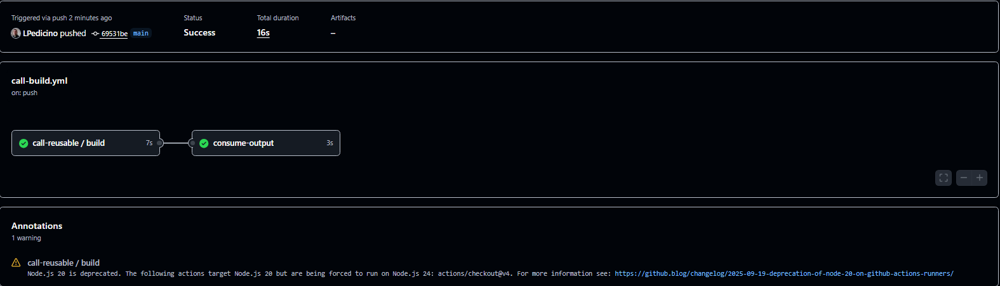

# Day 46: Reusable Workflows & Composite Actions

## Overview
Today's focus is on mastering code reuse in GitHub Actions by implementing **Reusable Workflows** (to avoid duplicating entire pipelines across repositories) and **Composite Actions** (to bundle recurring sets of steps).

---

## Task 1 & Task 6: Reusable Workflow vs Composite Action Comparison

### Concepts
- **Reusable Workflow:** Allows you to reuse whole workflow files from other workflows, preventing code duplication. It is triggered by `workflow_call` and can manage its own jobs and secrets.
- **Composite Action:** Allows you to bundle multiple workflow steps into a single action (`action.yml`) that can be executed as a step within a job (`uses:`).

### Comparison Table

| Feature | Reusable Workflow | Composite Action |
| :--- | :--- | :--- |
| **Triggered by** | `workflow_call` | `uses:` inside a step |
| **Can contain jobs?** | Yes (multiple jobs) | No (only steps) |
| **Can contain multiple steps?** | Yes | Yes |
| **Lives where?** | `.github/workflows/` | Any directory (e.g., `.github/actions/`) |
| **Can accept secrets directly?** | Yes (`secrets:`) | No (inherits from calling job) |
| **Best for** | Orchestrating entire pipelines / shared processes | Reusing repetitive step blocks (e.g., setup, installs) |

---

## Task 2: Reusable Workflow Code
File location: `.github/workflows/reusable-build.yml`

```yaml
name: Reusable Build Pipeline

on:
  workflow_call:
    inputs:
      app_name:
        description: 'Name of the application'
        required: true
        type: string
      environment:
        description: 'Target environment'
        required: true
        type: string
        default: 'staging'
    secrets:
      docker_token:
        description: 'Docker Hub Token'
        required: true
    outputs:
      build_version:
        description: 'Generated build version'
        value: ${{ jobs.build.outputs.version }}

jobs:
  build:
    runs-on: ubuntu-latest
    outputs:
      version: ${{ steps.gen_version.outputs.VERSION }}
    steps:
      - name: Checkout code
        uses: actions/checkout@v4

      - name: Print build details
        run: |
          echo "Building ${{ inputs.app_name }} for environment:${{ inputs.environment }}"

      - name: Check secret status
        run: |
          if [ -n "${{ secrets.DOCKER_TOKEN }}" ]; then
            echo "Docker token is set: true"
          else
            echo "Docker token is set: false"
          fi

      - name: Generate version string
        id: gen_version
        run: |
          SHORT_SHA=$(git rev-parse --short HEAD)
          VERSION="v1.0-$SHORT_SHA"
          echo "VERSION=$VERSION" >> $GITHUB_OUTPUT
          echo "Generated version: $VERSION"
```

## Task 3 & Task 4: Caller Workflow Code
File location: `.github/workflows/call-build.yml`

```yaml
name: Caller Workflow

on:
  push:
    branches: [ "main" ]

jobs:
  call-reusable:
    uses: ./.github/workflows/reusable-build.yml
    with:
      app_name: "my-web-app"
      environment: "production"
    secrets:
      docker_token: ${{ secrets.DOCKER_TOKEN }}

  consume-output:
    needs: call-reusable
    runs-on: ubuntu-latest
    steps:
      - name: Read reusable workflow output
        run: |
          echo "The build version received from the reusable workflow is: ${{ needs.call-reusable.outputs.build_version }}"
```

## Task 5: Composite Action Code
File location: `.github/actions/setup-and-greet/action.yml`

```yaml
name: "Setup and Greet"
description: "Custom composite action to greet and show runner details"
inputs:
  name:
    description: "Who to greet"
    required: true
    default: "DevOps Engineer"
  language:
    description: "Greeting language (en/es)"
    required: false
    default: "en"
outputs:
  greeted:
    description: "Indicates success"
    value: "true"
runs:
  using: "composite"
  steps:
    - name: Greet user
      shell: bash
      run: |
        LANG="${{ inputs.language }}"
        NAME="${{ inputs.name }}"
        if [ "$LANG" = "es" ]; then
          echo "¡Hola, $NAME! Bienvenido al pipeline."
        else
          echo "Hello, $NAME! Welcome to the pipeline."
        fi
    - name: Print Date and OS
      shell: bash
      run: |
        echo "Current date: $(date)"
        echo "Runner OS: $RUNNER_OS"
        echo "greeting-status=true" >> $GITHUB_OUTPUT
```

---

## Pipeline Execution Screenshot

