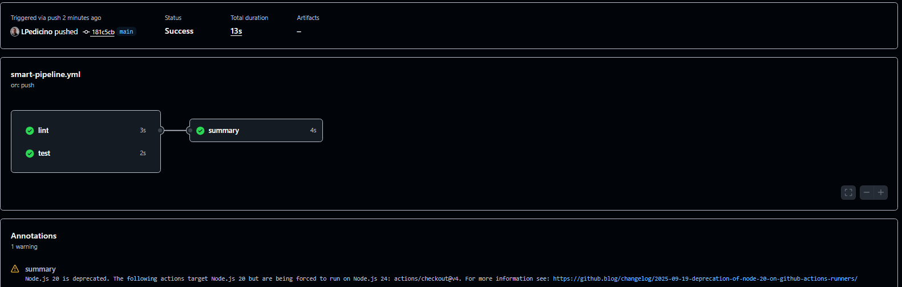

# Day 47: Advanced Triggers - PR Events, Cron Schedules & Event-Driven Pipelines

## Overview
Today's focus is on mastering advanced GitHub Actions triggers, including Pull Request lifecycle events, automated time-based cron jobs, path/branch filtering, asynchronous workflow chaining (`workflow_run`), and external event-driven triggers (`repository_dispatch`).

---

## Task 1: Pull Request Lifecycle Workflow (`pr-lifecycle.yml`)
File location: `.github/workflows/pr-lifecycle.yml`

```yaml
name: PR Lifecycle

on:
  pull_request:
    types: [opened, synchronize, reopened, closed]

jobs:
  pr-info:
    runs-on: ubuntu-latest
    steps:
      - name: Print PR Event Details
        run: |
          echo "Event Action: ${{ github.event.action }}"
          echo "PR Title: ${{ github.event.pull_request.title }}"
          echo "PR Author: ${{ github.event.pull_request.user.login }}"
          echo "Source Branch: ${{ github.head_ref }}"
          echo "Target Branch: ${{ github.base_ref }}"

      - name: Check if PR was merged
        if: github.event.action == 'closed' && github.event.pull_request.merged == true
        run: |
          echo "🎉 This PR was successfully merged!"
```

## Task 2: PR Validation Gates (`pr-checks.yml`)
File location: `.github/workflows/pr-checks.yml`

```yaml
name: PR Validation Gates

on:
  pull_request:
    branches: [ "main" ]

jobs:
  file-size-check:
    runs-on: ubuntu-latest
    steps:
      - name: Checkout code
        uses: actions/checkout@v4
        with:
          fetch-depth: 0

      - name: Check for files larger than 1MB
        run: |
          echo "Checking file sizes..."
          LARGE_FILES=$(find . -type f -not -path '*/.*' -size +1M)
          if [ -n "$LARGE_FILES" ]; then
```

## Task 3: Scheduled Workflows & Cron Deep Dive (scheduled-tasks.yml)
File location: .github/workflows/scheduled-tasks.yml

```yaml
name: Scheduled Tasks

on:
  schedule:
    - cron: '30 2 * * 1'   # Every Monday at 2:30 AM UTC
    - cron: '0 */6 * * *'    # Every 6 hours
  workflow_dispatch:

jobs:
  cron-health-check:
    runs-on: ubuntu-latest
    steps:
      - name: Identify trigger
        run: |
          echo "Triggered by schedule: ${{ github.event.schedule }}"
          echo "Event name: ${{ github.event_name }}"
      - name: Health Check Request
        run: |
          echo "Executing health check..."
          curl -I [https://httpbin.org/status/200](https://httpbin.org/status/200)
```

## Cron Expression Notes
- Every weekday at 9 AM IST (UTC+5:30 -> 3:30 AM UTC): `30 3 * * 1-5`
- First day of every month at midnight UTC: `0 0 1 * *`
- Why scheduled workflows are delayed or skipped on inactive repos: GitHub pauses or de-prioritizes scheduled triggers if a repository has experienced zero commit activity or web interactions for 60 consecutive days to save cluster runner resources.

## Task 4: Path & Branch Filters (`smart-triggers.yml`)
File location: `.github/workflows/smart-triggers.yml`

```yaml
name: Smart Triggers
on:
  push:
    branches:
      - main
      - 'release/*'
    paths:
      - 'src/**'
      - 'app/**'
    paths-ignore:
      - '*.md'
      - 'docs/**'
jobs:
  smart-build:
    runs-on: ubuntu-latest
    steps:
      - name: Run on source/app code changes only
        run: |
          echo "This pipeline runs only when changes are made inside src/ or app/ on main or release branches, ignoring markdown and docs."
```

### Paths vs Paths-Ignore Notes
- **paths:** Used when a workflow must trigger exclusively when specific directories or components are modified (e.g., triggering frontend tests only when frontend source files change).
- **paths-ignore:** Used when a pipeline should run on general repository updates except for documentation additions, README edits, or minor asset adjustments that do not impact compilation or code execution.

## Task 5: Workflow Chaining (`workflow_run`)

### 1. Test Workflow (`tests.yml`)
File location: `.github/workflows/tests.yml`

```yaml
name: Run Tests
on:
  push:
    branches: [ "main" ]
jobs:
  test:
    runs-on: ubuntu-latest
    steps:
      - name: Run unit tests
        run: |
          echo "Running test suite..."
          echo "Tests passed successfully!"
```

### 2. Deploy Workflow (`deploy-after-tests.yml`)
File location: `.github/workflows/deploy-after-tests.yml`

```yaml
name: Deploy After Tests
on:
  workflow_run:
    workflows: ["Run Tests"]
    types: [completed]
jobs:
  deploy:
    runs-on: ubuntu-latest
    steps:
      - name: Check upstream workflow status
        run: |
          CONCLUSION="${{ github.event.workflow_run.conclusion }}"
          echo "Upstream tests conclusion: $CONCLUSION"
          if [ "$CONCLUSION" != "success" ]; then
            echo "Error: Upstream tests failed. Aborting deployment."
            exit 1
          else
            echo "Tests passed! Proceeding with deployment..."
          fi
```

## Task 6: External Event Triggers (`external-trigger.yml`)
File location: `.github/workflows/external-trigger.yml`

```yaml
name: External Trigger
on:
  repository_dispatch:
    types: [deploy-request]
jobs:
  external-deploy:
    runs-on: ubuntu-latest
    steps:
      - name: Handle external dispatch
        run: |
          echo "Received external deployment request!"
          echo "Target Environment: ${{ github.event.client_payload.environment }}"
```

### External Triggers Use Case
External systems (such as Datadog or PagerDuty monitoring alerts, CMS publishing webhooks, or chat-ops bots) trigger pipelines via GitHub API webhooks when an external action or remediation task needs to invoke repository CI/CD flows on demand.

## Concept Explanation: `workflow_run` vs `workflow_call`
- **workflow_call:** Operates synchronously (as a subroutine or function). The caller workflow explicitly invokes the reusable workflow, passes inputs/secrets, and blocks execution until the reusable workflow finishes inside the same active graph.
- **workflow_run:** Operates asynchronously (event-driven). It triggers automatically after an upstream workflow finishes completely (regardless of success or failure), letting you decouple pipelines—such as initiating a deployment sequence only after main branch test checks conclude successfully.

---

## PR Validation Screenshot

