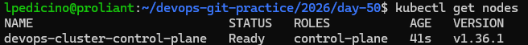
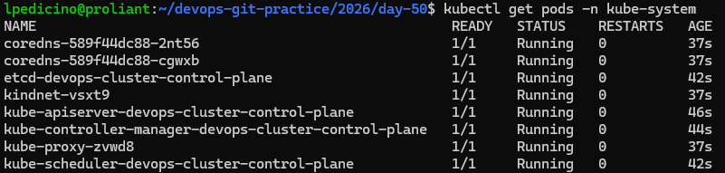

# Day 50 – Kubernetes Architecture and Cluster Setup

## Kubernetes History in Your Own Words

Kubernetes was created by Google based on their years of experience running production workloads with internal systems like Borg. It was designed to solve the complexity of managing, scaling, and coordinating hundreds or thousands of containers distributed across multiple servers—a challenge that Docker alone (operating at a single-host level) cannot handle natively. The name "Kubernetes" comes from the Greek word meaning "helmsman" or "pilot".

---

## Kubernetes Architecture Diagram

```text
+-----------------------------------------------------------------+
|                       CONTROL PLANE                             |
|                                                                 |
|  +------------------+      +------------------+                 |
|  |    API Server    |<---->|       etcd       |                 |
|  +------------------+      +------------------+                 |
|           ^                                                     |
|           |                                                     |
|           v                                                     |
|  +------------------+      +------------------+                 |
|  |    Scheduler     |      |Controller Manager|                 |
|  +------------------+      +------------------+                 |
+-----------------------------------------------------------------+
^
| (Communicates via API Server)
v
+-----------------------------------------------------------------+
|                        WORKER NODE                              |
|                                                                 |
|  +------------------+      +------------------+                 |
|  |     Kubelet      |      |    Kube-proxy    |                 |
|  +------------------+      +------------------+                 |
|           ^                                                     |
|           |                                                     |
|           v                                                     |
|  +--------------------------------------------+                 |
|  |             Container Runtime              |                 |
|  +--------------------------------------------+                 |
+-----------------------------------------------------------------+
```

### Component Breakdown
1. **API Server:** The frontend and entry point of the cluster; all administrative commands and requests go through it.
2. **etcd:** A consistent and highly-available key-value store used as Kubernetes' backing store for all cluster data.
3. **Scheduler:** Watches for newly created pods with no assigned node and selects one for them to run on.
4. **Controller Manager:** Runs controller processes that regulate the state of the cluster, ensuring the desired state matches current reality.
5. **Kubelet:** An agent that runs on each node in the cluster, ensuring that containers are running inside a Pod.
6. **Kube-proxy:** Maintains network rules on nodes, allowing network communication to your pods from network sessions inside or outside of your cluster.

---

## Tool Selection: kind (Kubernetes in Docker)

We chose **`kind`** for this local setup because it uses Docker containers as cluster nodes. This allows a fully functional, lightweight Kubernetes cluster to run seamlessly locally on top of the container environment we have already built and mastered during previous days.

---

## Cluster Verification & Output


### Cluster Info & Nodes
```bash
kubectl cluster-info
kubectl get nodes
```


### Control Plane Components in kube-system
```bash
kubectl get pods -n kube-system
```



