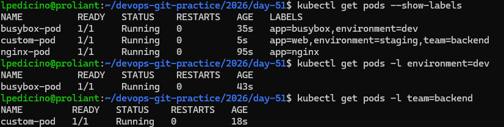

# Day 51: Kubernetes Manifests and Your First Pods

## 1. The Four Required Fields of a Kubernetes Manifest
Every Kubernetes resource YAML requires four top-level fields:
* **`apiVersion`**: Specifies the API version group to use for the resource (e.g., `v1` for Pods).
* **`kind`**: Defines the type of resource you want to create (e.g., `Pod`).
* **`metadata`**: Contains identity data like the resource `name` and optional `labels` or `namespaces`.
* **`spec`**: Describes the desired state of the resource, such as the containers to run, images, and ports.

---

## 2. Pod Manifests

### Nginx Pod (`nginx-pod.yaml`)

```yaml
apiVersion: v1
kind: Pod
metadata:
  name: nginx-pod
  labels:
    app: nginx
spec:
  containers:
  - name: nginx
    image: nginx:latest
    ports:
    - containerPort: 80
```

## BusyBox Pod (`busybox-pod.yaml`)

```yaml
apiVersion: v1
kind: Pod
metadata:
  name: busybox-pod
  labels:
    app: busybox
    environment: dev
spec:
  containers:
  - name: busybox
    image: busybox:latest
    command: ["sh", "-c", "echo Hello from BusyBox && sleep 3600"]
```

## Custom Pod (`custom-pod.yaml`)

```yaml
apiVersion: v1
kind: Pod
metadata:
  name: custom-pod
  labels:
    app: web
    environment: staging
    team: backend
spec:
  containers:
  - name: web-app
    image: nginx:latest
    ports:
    - containerPort: 80
```

## 3. Imperative vs Declarative Approaches

* **Imperative (`kubectl run` / `kubectl delete`)**: You tell Kubernetes what to do directly on the command line step-by-step. Useful for quick tests or debugging.
* **Declarative (`kubectl apply -f`)**: You define the desired state in a configuration file (YAML) and apply it. Kubernetes figures out how to make the current state match the desired state. This is the standard for version control and production environments.

## 4. What Happens When You Delete a Standalone Pod?

When you delete a standalone Pod, it is deleted permanently and gone forever. There is no controller (like a Deployment or ReplicaSet) monitoring it to recreate it, which is why production workloads rely on higher-level abstractions.

## Pods Verification & Labels

