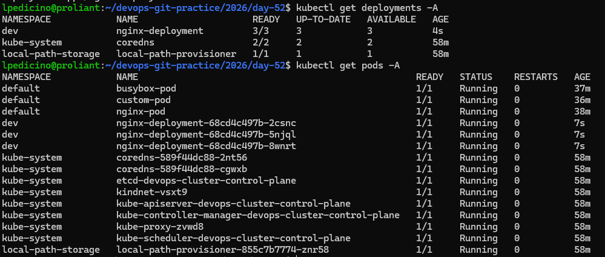

# Day 52: Kubernetes Namespaces and Deployments

## 1. What Are Namespaces and Why Use Them?
Namespaces provide a mechanism for isolating group resources within a single cluster. They are used to:
* **Divide cluster resources** between multiple teams, projects, or environments (e.g., `dev`, `staging`, `production`).
* **Avoid naming collisions** by allowing the same resource name to exist in different namespaces.
* **Apply resource quotas and security policies** per scope.

---

## 2. Deployment Manifest (`nginx-deployment.yaml`)

```yaml
apiVersion: apps/v1
kind: Deployment
metadata:
  name: nginx-deployment
  namespace: dev
  labels:
    app: nginx
spec:
  replicas: 3
  selector:
    matchLabels:
      app: nginx
  template:
    metadata:
      labels:
        app: nginx
    spec:
      containers:
      - name: nginx
        image: nginx:1.24
        ports:
        - containerPort: 80
```

## Section Breakdown

* **`apiVersion: apps/v1`**: Uses the apps API group required for high-level controllers like Deployments.
* **`kind: Deployment`**: Specifies that this resource is a Deployment rather than a standalone Pod.
* **`metadata`**: Defines the name (`nginx-deployment`), target namespace (`dev`), and labels.
* **`spec.replicas: 3`**: Instructs Kubernetes to maintain exactly 3 identical pods running at all times.
* **`spec.selector.matchLabels`**: Connects the Deployment to any pods bearing the matching label (`app: nginx`).
* **`spec.template`**: The blueprint used to create the individual Pods managed by this Deployment.

## 3. Standalone Pods vs. Deployment-Managed Pods

* **Standalone Pod**: Created directly. If deleted or if the node fails, it is deleted permanently and gone forever.
* **Deployment-Managed Pod**: Backed by a controller. If a pod crashes or is deleted manually, the Deployment controller automatically detects the discrepancy and recreates it instantly (Self-Healing).

## 4. Scaling Deployments

* **Imperative Scaling**: Adjusting the number of replicas dynamically via command line without modifying the manifest file:
  ```bash
  kubectl scale deployment nginx-deployment --replicas=5 -n dev
  ```

* **Declarative Scaling**: Modifying the `replicas` field directly inside the YAML manifest and applying it via `kubectl apply -f`.

## 5. Rolling Updates and Rollbacks

* **Rolling Update**: Replaces old pods with new ones incrementally (zero downtime), ensuring availability during image upgrades:
  ```bash
  kubectl set image deployment/nginx-deployment nginx=nginx:1.25 -n dev
  ```

* **Rollback**: Reverts a deployment back to its previous stable revision if an issue arises:
  ```bash
  kubectl rollout undo deployment/nginx-deployment -n dev
  ```

## 6. Verification Screenshot


