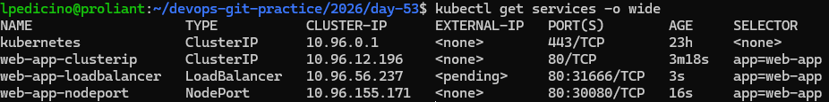

# Day 53: Kubernetes Services

## 1. What Problem Do Services Solve?
Every Pod gets its own IP address, but two core issues arise:
* **Dynamic Pod IPs:** Pods are ephemeral. When a Pod restarts or is replaced by a Deployment, it receives a new IP address.
* **Load Distribution:** A Deployment typically runs multiple replica Pods. Clients need a single stable entry point rather than choosing a specific Pod IP.

**Services** solve this by providing:
* A stable IP address and DNS name that never change.
* Built-in load balancing across all matching backend Pods via selectors.

---

## 2. Service Manifests and Types

### ClusterIP (Internal Access)
The default service type. It exposes the service on a cluster-internal IP, making it only reachable from within the cluster.
```yaml
apiVersion: v1
kind: Service
metadata:
  name: web-app-clusterip
spec:
  type: ClusterIP
  selector:
    app: web-app
  ports:
  - port: 80
    targetPort: 80
```

## NodePort (External Access via Node)
Exposes the service on a static port on each node’s IP (`30000-32767` range). This allows traffic from outside the cluster to access the service via `<NodeIP>:<NodePort>`.

```yaml
apiVersion: v1
kind: Service
metadata:
  name: web-app-nodeport
spec:
  type: NodePort
  selector:
    app: web-app
  ports:
  - port: 80
    targetPort: 80
    nodePort: 30080
```

## LoadBalancer (Cloud External Access)
Provisions an external load balancer (in supported cloud providers) which automatically routes traffic to the NodePort / ClusterIP backend. In local clusters (like Kind), the external IP remains `<pending>`.

```yaml
apiVersion: v1
kind: Service
metadata:
  name: web-app-loadbalancer
spec:
  type: LoadBalancer
  selector:
    app: web-app
  ports:
  - port: 80
    targetPort: 80
```

## 3. Kubernetes DNS and Service Discovery
Kubernetes includes a built-in DNS server that assigns a DNS entry to every Service:

* **Short Name:** `<service-name>` (usable within the same namespace)
* **Full DNS Name:** `<service-name>.<namespace>.svc.cluster.local`

## 4. Endpoints
Behind every Service lies an **Endpoints** object (`kubectl get endpoints`), which dynamically tracks the individual IP addresses and ports of the healthy Pods matching the Service's selector.

## 5. Services Verification Screenshot


