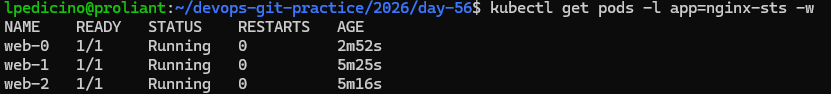
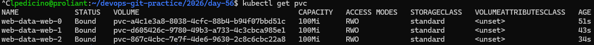
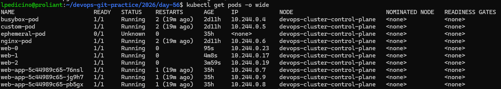

# Day 56 – Kubernetes StatefulSets

## Overview
Today's objective was to master **StatefulSets**, the Kubernetes workload API used to manage stateful applications (such as databases, message brokers, and clustered applications) that require unique network identifiers, stable persistent storage, and ordered, graceful deployment and scaling.

---

## 1. What are StatefulSets and When to Use Them?
Unlike **Deployments** (designed for stateless web servers or microservices where pods are completely interchangeable), **StatefulSets** maintain a sticky identity for each of their pods. 

### Use StatefulSets when your application requires:
* **Stable, unique network identifiers** (e.g., `web-0`, `web-1`, `web-2`).
* **Stable, persistent storage** mapped individually to each pod, surviving rescheduling or deletion.
* **Ordered, graceful deployment, scaling, and rolling updates** (e.g., pod-0 must be Running and Ready before pod-1 starts).

---

## 2. Comparison: Deployments vs. StatefulSets

| Feature | Deployment | StatefulSet |
| :--- | :--- | :--- |
| **Pod Names** | Random hashes (e.g., `web-dep-5d59b8-xyz12`) | Stable and ordinal (e.g., `web-0`, `web-1`) |
| **Startup Order** | All pods created concurrently | Ordered and sequential (`0`, then `1`, then `2`) |
| **Storage (PVC)** | Shared PVC across replicas (or independent stateless) | Each pod gets its own dedicated, unique PVC via templates |
| **Network Identity** | Single ClusterIP load-balancing across all pods | Stable individual DNS entries per pod via Headless Service |
| **Scaling Down** | Terminates pods simultaneously in random order | Terminates pods in reverse order (`2`, then `1`, then `0`) |

---

## 3. Core Components Implemented

### A. Headless Service (`clusterIP: None`)
A Headless Service does not allocate a single load-balanced cluster IP. Instead, it creates individual DNS records for each pod belonging to the StatefulSet, enabling direct network communication and stable addressing.

### B. Volume Claim Templates (`volumeClaimTemplates`)
This feature ensures that every replica gets its own dedicated Persistent Volume Claim (PVC) following the pattern `<template-name>-<pod-name>`, ensuring data persistence even if a pod is deleted or crashes.

---

## 4. Verification and Execution Steps

1. **Headless Service & StatefulSet Deployment:**
   * Created a Headless Service with `clusterIP: None`.
   * Deployed a 3-replica StatefulSet using an `nginx` image and `volumeClaimTemplates` (100Mi).
   * Observed ordered creation (`web-0` $\rightarrow$ `web-1` $\rightarrow$ `web-2`).

2. **Stable Network Identity (DNS Resolution):**
   * Verified individual pod resolution using `nslookup`:
     * `web-0.nginx-headless.default.svc.cluster.local` $\rightarrow$ Pod IP (`10.244.0.15`)
     * `web-1.nginx-headless.default.svc.cluster.local` $\rightarrow$ Pod IP (`10.244.0.17`)
     * `web-2.nginx-headless.default.svc.cluster.local` $\rightarrow$ Pod IP (`10.244.0.19`)

3. **Data Persistence Across Pod Deletion:**
   * Wrote custom text to `web-0`: 
     ```bash
     kubectl exec web-0 -- sh -c "echo 'Data from web-0' > /usr/share/nginx/html/index.html"
     ```
   * Deleted `web-0` (`kubectl delete pod web-0`) and verified that upon recreation, the file content **`Data from web-0`** persisted successfully.

4. **Ordered Scaling & Safety:**
   * Scaled up to 5 replicas (pods created sequentially: `web-3`, `web-4`).
   * Scaled down to 3 replicas (pods terminated in reverse order: `web-4`, `web-3`).
   * Confirmed that PVCs are retained on scale-down and StatefulSet deletion to protect application data.

---

## 5. Screenshots / Evidence

### StatefulSet Pods (Ordered Creation & Identity)


### Persistent Volume Claims (PVCs)


### Pods Wide IPs and Network Verification


