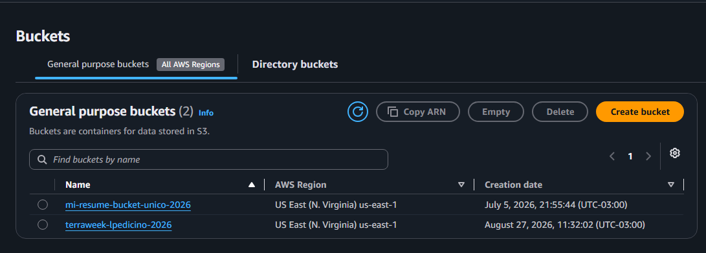

# Day 61: Introduction to Terraform & IaC

## Task 1: Understand Infrastructure as Code (IaC)

- **What is IaC and why does it matter?** Infrastructure as Code is the practice of managing and provisioning computing infrastructure through machine-readable definition files rather than physical hardware configuration or interactive configuration tools. It matters because it brings software engineering practices (version control, automated testing, CI/CD) to infrastructure operations, ensuring speed and consistency.
- **Problems solved vs. AWS Console:** Manual console clicking leads to "configuration drift," lack of reproducibility, undocumented changes ("snowflake servers"), and human error. IaC provides repeatable, auditable, and version-controlled environments.
- **Terraform vs. CloudFormation, Ansible, and Pulumi:** CloudFormation is tightly coupled to AWS (less cloud-agnostic), Ansible is primarily a configuration management and procedural tool (though it can provision), Pulumi uses general-purpose programming languages (Python, TypeScript) instead of a dedicated DSL like HCL, and Terraform is open-source, declarative, and multi-cloud.
- **Declarative and Cloud-Agnostic:** "Declarative" means you define *what* the end state should look like, and Terraform figures out *how* to get there. "Cloud-agnostic" means the same workflow and language (HCL) can provision resources across AWS, Azure, GCP, and other providers.

## Task 3: Provision an S3 Bucket with Terraform

- **Provider Configuration:** Configured the HashiCorp AWS provider targeting `us-east-1` and initialized the working directory using `terraform init`.
- **Resource Definition:** Wrote an HCL configuration (`main.tf`) to provision a unique AWS S3 bucket (`terraweek-lpedicino-2026`).
- **Lifecycle Execution:** Executed `terraform plan` to preview the infrastructure changes, `terraform apply` to successfully deploy the bucket, and finally `terraform destroy` to clean up resources securely.
- **Verification Screenshot:**

