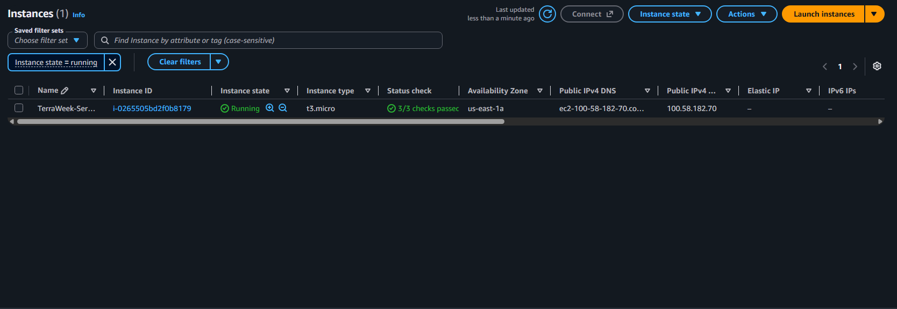
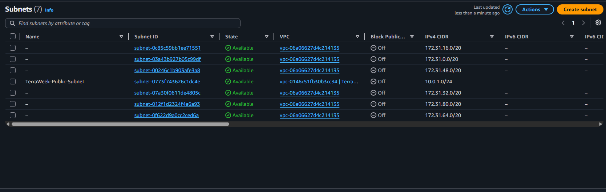
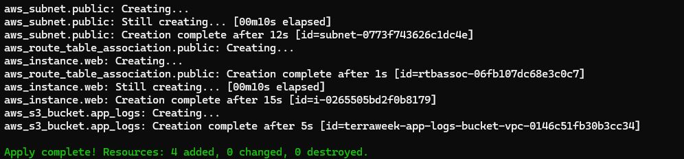
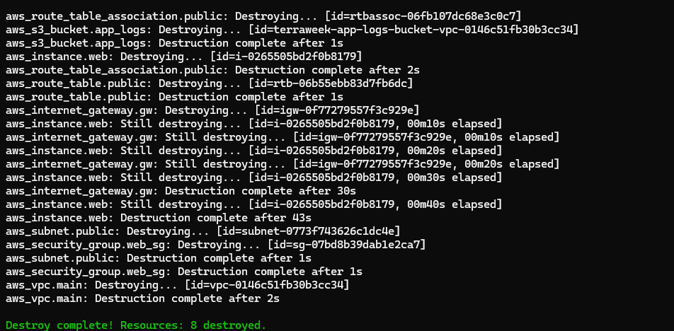

# Day 62: AWS Infrastructure and Networking with Terraform

## Overview
Today's challenge focused on building a complete and functional networking stack on AWS using Terraform, managing providers, handling resource dependencies, and solving availability zone constraints.

## Architecture Components Created
1. **Virtual Private Cloud (VPC):** Custom VPC with CIDR `10.0.0.0/16` and DNS hostnames enabled (`TerraWeek-VPC`).
2. **Public Subnet:** Configured inside the VPC with CIDR `10.0.1.0/24`, mapped public IP on launch, and explicitly pinned to availability zone `us-east-1a` to avoid t3 instance capacity restrictions (`TerraWeek-Public-Subnet`).
3. **Internet Gateway (IGW):** Attached to the VPC to provide internet access (`TerraWeek-IGW`).
4. **Route Table:** Public route table pointing `0.0.0.0/0` to the Internet Gateway, associated with our public subnet (`TerraWeek-Public-Route-Table`).
5. **Security Group:** Allows inbound traffic on port 22 (SSH) and port 80 (HTTP), plus full outbound access (`TerraWeek-Web-SG`).
6. **EC2 Instance:** A `t3.micro` web server deployed inside the public subnet with an associated security group (`TerraWeek-Server`).
7. **S3 Bucket:** Dynamic application logs bucket tied to the VPC configuration (`TerraWeek-App-Logs`).

## Key Learnings & Troubleshooting
- **Provider Version Constraints:** Configured the AWS provider specifying required versions to ensure stability across environments.
- **Implicit vs. Explicit Dependencies:** Terraform automatically builds dependency graphs using reference attributes (e.g., using `aws_vpc.main.id`), but explicit dependencies can also be managed using `depends_on`.
- **Availability Zone Capacity Constraints:** Encountered a capacity error (`InsufficientInstanceCapacity`) when launching a `t3.micro` in `us-east-1e`. Solved it by explicitly defining `availability_zone = "us-east-1a"` in the subnet configuration.
- **Resource Replacement Handling:** Managed CIDR conflicts during subnet AZ migration by cleanly targeting resource destructions (`terraform destroy -target`) and re-applying the configuration.

## Deployment Evidence

### EC2 Instance Running (us-east-1a)

### Public Subnet Creation

### Terraform Apply Output

### Cleanup / Terraform Destroy Output

